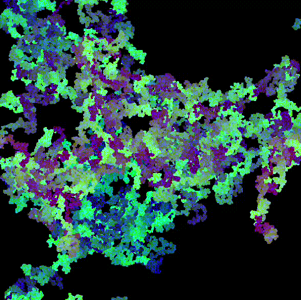

## Hello, I'm Luke Dias ✨

### Stuff about me 🧐
- 👨‍💻 Currently working for *[Hurb](https://zerezes.com.br/pages/sobre)* as a *Software Engineer*!;
- 🌱 Currently reading: *The Go Programming Language*;
- 💪🏼 Next Study Goals: *Learn You a Haskell for Great Good!*;
- 🧙‍♂️ Good at: *C#*, *MySQL*, *System Design*;
- 🧙 Getting Good at: *Rust*, *Haskell*, *JavaScript*, *Advanced Algorithms*;
- 🕵🏻‍♂️ Current Fascinations: *Image Processing*, *Noise*, *Fractals*;
- ⚡ Other Interests: *Sci-Fi*, *High and Low Fantasy*, *Boardgames*, *Videogames* and *movies*!

### Find me at 📝
[][linkedin]
[][whatsapp]
[][medium]
[][exercism]
 

[linkedin]: https://www.linkedin.com/in/lukedias/
[medium]: https://medium.com/@lhollowwizard
[exercism]: https://exercism.org/profiles/LukeDias42
